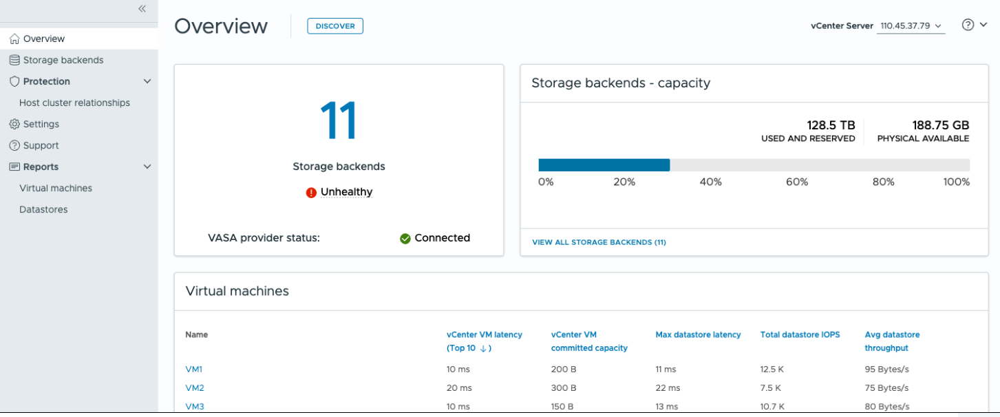

= Découvrez le tableau de bord des ONTAP tools for VMware vSphere
:allow-uri-read: 
:icons: font
:imagesdir: ../media/

[role="lead"]
Sélectionnez l'icône du plug-in ONTAP tools for VMware vSphere dans la section des raccourcis du client vCenter pour ouvrir le tableau de bord, qui récapitule l'état du plug-in, des datastores et des données du serveur vCenter.

En mode lié amélioré (ELM), la liste déroulante vCenter Server apparaît.  Choisissez un serveur vCenter pour afficher ses données.  La liste déroulante est disponible dans toutes les vues de liste du plug-in. Lorsque vous sélectionnez un serveur vCenter sur une page, il reste identique lorsque vous changez d'onglet dans le plug-in.

Depuis la page de présentation, vous pouvez exécuter l'action *Discovery* pour détecter les systèmes de stockage, hôtes, banques de données et états ou relations de protection nouvellement ajoutés ou mis à jour au niveau de vCenter. Exécutez une découverte à la demande sans attendre la découverte planifiée.

Si vous ajoutez un nouvel hôte à un cluster d'hôtes protégés, les paramètres de protection passent à *Protection partielle*.

Pour résoudre ce problème, ouvrez *Modifier la configuration du cluster*, attribuez l'hôte au site approprié (source ou cible) et sélectionnez *Modifier*.

NOTE: Le bouton *Découverte* n'est activé que si vous disposez du privilège requis pour effectuer la découverte.

Une fois la demande de découverte soumise, vous pouvez suivre la progression de l'action dans le panneau des tâches récentes.

Le tableau de bord comporte plusieurs cartes montrant différents éléments du système. Le tableau suivant montre les différentes cartes et ce qu'elles représentent.

|===

| *Carte* | *Description* 

| État | La fiche d'état affiche le nombre de storage backends et l'état de santé global des storage backends et du VASA Provider. L'état des storage backends indique *Sain* lorsque tous les statuts des storage backends sont normaux et *Non sain* si un storage backend présente un problème (statut Inconnu/Injoignable/Dégradé). Sélectionnez l'infobulle pour ouvrir les détails de l'état des storage backends. Vous pouvez sélectionner n'importe quel storage backend pour plus de détails. Le lien *Autres états du VASA Provider* affiche l'état actuel du VASA Provider enregistré dans le vCenter Server. 

| Systèmes back-end de stockage - capacité | Cette fiche présente la capacité cumulée utilisée et disponible de tous les backends de stockage pour l’instance de serveur vCenter sélectionnée. Pour les systèmes de stockage ASA r2, les données de capacité ne sont pas affichées car le stockage est désagrégé. 

| Ordinateurs virtuels | Cette fiche présente les 10 machines virtuelles principales, classées par indicateur de performance. Vous pouvez sélectionner l'en-tête pour trier les 10 machines virtuelles principales selon l'indicateur sélectionné, par ordre croissant ou décroissant. Les modifications de tri et de filtrage effectuées sur la fiche sont conservées jusqu'à ce que vous modifiiez ou effaciez le cache de votre navigateur. 

| Datastore | Cette fiche présente les 10 meilleurs datastores, classés selon un indicateur de performance. Vous pouvez sélectionner l'en-tête pour trier les 10 meilleurs datastores pour l'indicateur sélectionné par ordre croissant ou décroissant. Les modifications de tri et de filtrage effectuées sur la fiche sont conservées jusqu'à ce que vous les modifiiez ou que vous vidiez le cache du navigateur. Utilisez la liste déroulante « Type de datastore » pour sélectionner le type de datastore : NFS, VMFS ou vVols. 

| Carte de conformité de l'hôte ESXi | Cette fiche indique si tous les hôtes ESXi (pour le vCenter sélectionné) respectent les paramètres hôte NetApp recommandés par groupe ou catégorie. Vous pouvez sélectionner le lien *Appliquer les paramètres recommandés* pour appliquer les paramètres recommandés. Vous pouvez sélectionner l'état de conformité des hôtes pour afficher la liste des hôtes. 
|===