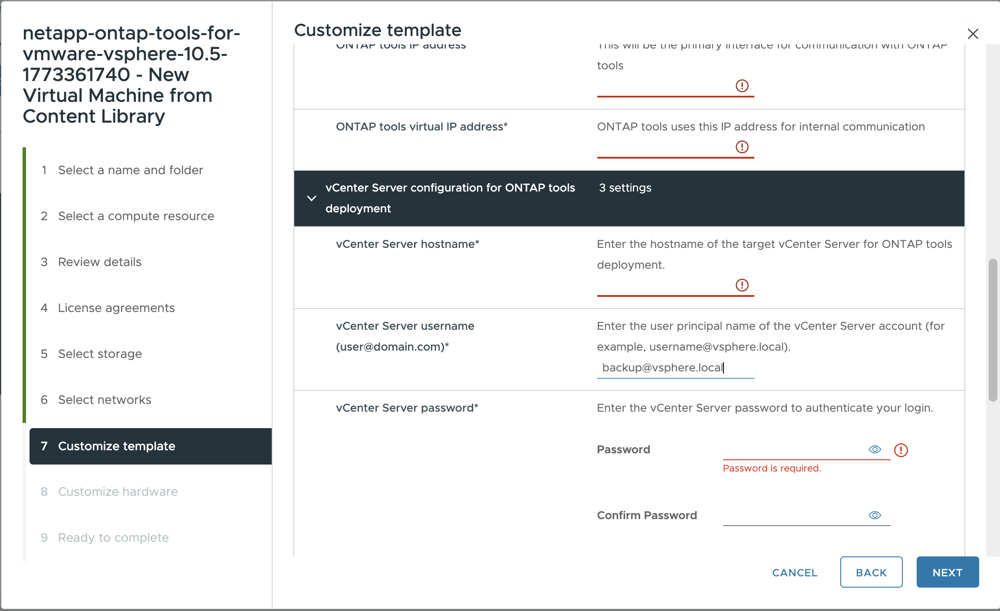

= Déployer les outils ONTAP
:allow-uri-read: 
:icons: font
:imagesdir: ../media/

[role="lead"]
Déployez ONTAP tools for VMware vSphere sous la forme d'un dispositif mono-nœud ultra-compact prenant en charge les datastores NFS et VMFS. Le processus de déploiement prend jusqu'à 45 minutes.

.Avant de commencer
Si vous déployez une configuration à nœud unique très compacte, une bibliothèque de contenu est facultative. Pour les déploiements multi-nœuds ou à haute disponibilité, une bibliothèque de contenu est requise.

Dans VMware, une bibliothèque de contenu stocke les modèles de machines virtuelles, les modèles vApp et d'autres fichiers. L'utilisation d'une bibliothèque de contenu simplifie le déploiement car elle ne dépend pas d'un accès réseau direct lors des opérations sur les modèles.

Avant de créer une bibliothèque de contenu :

* Créez la bibliothèque de contenu sur une banque de données partagée afin que tous les hôtes du cluster puissent y accéder.
* Créez la bibliothèque de contenu avant de déployer les ONTAP tools for VMware vSphere OVA.
* Conservez le modèle OVA dans la bibliothèque de contenu après le déploiement.

NOTE: Si vous prévoyez d'activer la haute disponibilité ultérieurement, déployez la machine virtuelle ONTAP tools dans un cluster ESXi ou un pool de ressources, et non directement sur un hôte ESXi.

Pour créer une bibliothèque de contenu :

. Téléchargez les binaires ONTAP tools for VMware vSphere (_.ova_) et les certificats signés à partir du  https://mysupport.netapp.com/site/products/all/details/otv10/downloads-tab["Site de support NetApp"^].
. Connectez-vous au client vSphere.
. Dans le menu vSphere Client, sélectionnez *Bibliothèques de contenu*.
. Sélectionnez *Créer*.
. Saisissez un nom et créez la bibliothèque de contenu.
. Ouvrez la bibliothèque de contenu que vous avez créée.
. Sélectionnez *Actions* > *Importer un élément*, puis importez le fichier OVA.

NOTE: Pour plus d'informations, consultez https://blogs.vmware.com/vsphere/2020/01/creating-and-using-content-library.html["Création et utilisation de la bibliothèque de contenu"].

NOTE: Avant le déploiement, configurez le planificateur de ressources distribuées (DRS) du cluster sur Conservateur pour éviter la migration des machines virtuelles pendant l'installation.

ONTAP tools for VMware vSphere est initialement déployé en configuration non-HA. À partir de ONTAP tools 10.6, l'ajout à chaud de CPU et la connexion à chaud de mémoire sont activés par défaut. Pour évoluer vers une configuration HA ultérieurement, ces fonctionnalités doivent être activées.

.Étapes
. Téléchargez le fichier OVA des ONTAP tools et les certificats signés depuis le  https://mysupport.netapp.com/site/products/all/details/otv10/downloads-tab["Site de support NetApp"^]. Si vous avez déjà importé le fichier OVA dans votre bibliothèque de contenu, ignorez cette étape.
. Connectez-vous au serveur vSphere.
. Accédez au pool de ressources, au cluster ou à l'hôte où vous souhaitez déployer l'OVA.
+

IMPORTANT: Ne stockez pas la machine virtuelle ONTAP tools sur les datastores vVols qu'elle gère.

. Déployez le fichier OVA depuis la bibliothèque de contenu ou le système local.
+
|===

| À partir du système local | À partir de la bibliothèque de contenu 

| a. cliquez avec le bouton droit de la souris et sélectionnez *déployer le modèle OVF...*. b. Choisissez le fichier OVA à partir de l'URL ou naviguez jusqu'à son emplacement, puis sélectionnez *Suivant*. | a. accédez à votre bibliothèque de contenu et sélectionnez l'élément de bibliothèque que vous souhaitez déployer. b. sélectionnez *actions* > *Nouveau VM à partir de ce modèle* 
|===
. Dans *Sélectionnez un nom et un dossier*, saisissez le nom et l'emplacement de la machine virtuelle.
. Sélectionnez une ressource d'ordinateur et sélectionnez *Suivant*. Si vous le souhaitez, cochez la case *mettre automatiquement sous tension la machine virtuelle déployée*.
. Passez en revue les détails du modèle et sélectionnez *Suivant*.
. Lisez et acceptez le contrat de licence et sélectionnez *Suivant*.
. Sélectionnez le stockage pour la configuration et le format du disque, puis sélectionnez *Suivant*.
. Sélectionnez le réseau de destination pour chaque réseau source et sélectionnez *Suivant*.
. Dans la fenêtre *Personnaliser le modèle*, saisissez les valeurs requises. 
+
[IMPORTANT]
====
Les valeurs indiquées sur la page *Personnaliser le modèle* sont obligatoires pour un déploiement réussi.

Portez une attention particulière à ces champs :

** *Nom de l'hôte* : Saisissez le nom de l'hôte de la machine virtuelle ONTAP tools. Utilisez un format de nom d'hôte valide.
** *Adresse IP des outils ONTAP* : Il s'agit de l'interface de gestion principale utilisée pour accéder aux outils ONTAP.
** *Adresse IPv4* : Il s’agit de l’adresse IP du nœud utilisée pour le shell de diagnostic et l’accès SSH à des fins de dépannage et de maintenance.

Si vous utilisez des noms DNS pour l'hôte ou vCenter, assurez-vous que ces noms sont correctement résolus dans le DNS.

====
+

NOTE: Le nom d'hôte vCenter correspond au nom de l'instance vCenter Server sur laquelle l'appliance ONTAP Tools est déployée.

+
Si vous déployez les outils ONTAP dans une topologie à deux serveurs vCenter, où l’appliance est hébergée dans une instance vCenter et gère une autre, attribuez un rôle restreint à l’instance vCenter qui héberge les outils ONTAP. Créez un utilisateur et un rôle vCenter dédiés, disposant uniquement des autorisations nécessaires au déploiement du modèle OVF. Pour plus de détails, consultez link:../concepts/rbac-vcenter-use.html#vsphere-object-hierarchy["Rôles inclus avec les outils ONTAP pour VMware vSphere 10"].

+
Pour l'instance vCenter gérée par ONTAP tools, assurez-vous que le compte utilisateur vCenter dispose des privilèges d'administrateur.

+
** Les noms d'hôte doivent inclure des lettres (A-Z, a-z), des chiffres (0-9) et des tirets (-). Pour une architecture à double pile, spécifiez le nom de l'hôte associé à l'adresse IPv6.
+

NOTE: L'IPv6 pur n'est pas pris en charge. Le mode mixte est pris en charge avec un VLAN contenant à la fois des adresses IPv6 et IPv4.

** L'adresse IP des ONTAP tools (anciennement load balancer) est le point de terminaison externe pour ONTAP tools Manager (`\https://<ip>:8443/virtualization/ui/`, les appels d'API et l'accès aux plug-ins depuis l'interface utilisateur vCenter.
** L'adresse IP virtuelle des ONTAP tools (anciennement node interconnect) est attribuée au serveur API Kubernetes (kube-api) et sert d'adresse IP virtuelle pour le plan de contrôle Kubernetes.
** L'adresse IPv4 est l'adresse de gestion du nœud associée au nom de l'hôte spécifié et est utilisée pour l'accès au shell de diagnostic et SSH.

. Consultez les détails dans la fenêtre *prêt à terminer*, sélectionnez *Terminer*.
+
Lorsque la tâche de déploiement démarre, la progression s'affiche dans la barre des tâches vSphere.

. Si vous n'avez pas sélectionné la mise sous tension automatique, mettez la machine virtuelle sous tension une fois la tâche terminée.

Suivez la progression de l'installation depuis la console web de la machine virtuelle.

En cas d'anomalies dans le formulaire OVF, une boîte de dialogue vous invite à effectuer les corrections nécessaires. Utilisez la touche Tabulation pour naviguer, apportez les modifications requises et sélectionnez *OK*. Vous disposez de trois tentatives pour résoudre les problèmes. Si les problèmes persistent après trois tentatives, l'installation s'arrête et vous devez relancer l'installation sur une nouvelle machine virtuelle.
