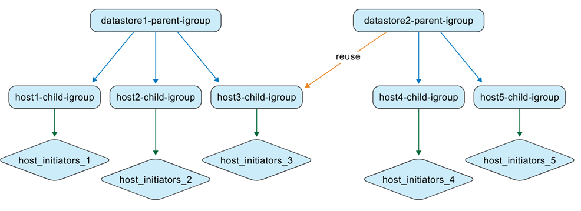

= Gestion des igroups imbriqués dans les outils ONTAP
:allow-uri-read: 
:icons: font
:imagesdir: ../media/

[role="lead"]
Si vous déplacez des banques de données d'environnements non gérés par ONTAP tools vers des environnements qui le sont, il est important de comprendre le comportement des igroups. ONTAP tools for VMware vSphere utilise un modèle d'igroups imbriqués, ce qui permet d'expliquer les différences de comportement entre les versions précédentes et l'implémentation actuelle.

À partir de ONTAP tools for VMware vSphere 10.4, ONTAP tools crée et gère automatiquement les objets ONTAP et vCenter, ce qui simplifie la gestion des datastores dans les environnements de datacenter VMware. À partir de ONTAP tools for VMware vSphere 10.5 P2, ONTAP tools supprime également automatiquement les igroups migrés lorsqu'ils ne sont plus utilisés.

[[quick-behavior-summary]]
== Résumé rapide du comportement

* Les datastores VMFS gérés par les outils ONTAP utilisent des igroups imbriqués : un igroup parent par contexte de datastore et des igroups enfants par hôte.
* Les mappages LUN sont appliqués aux igroups enfants.
* Les igroups parents personnalisés peuvent être réutilisés dans plusieurs datastores.
* Les igroups migrés depuis ONTAP tools 9.x ne peuvent pas être réutilisés.

[[igroup-contexts]]
== Contextes de groupe

Les outils ONTAP pour VMware vSphere gèrent les igroups dans deux contextes.

.igroups gérés par des outils non ONTAP
En tant qu'administrateur de stockage, vous pouvez créer des igroups sur le système ONTAP sous forme de structures plates ou imbriquées. L'illustration suivante montre un igroup plat créé directement dans ONTAP.

image:../media/non-otv-managed.png["Outils non gérés par ONTAP igroup"]

.igroups gérés par les outils ONTAP
Lorsque vous créez des banques de données, ONTAP tools for VMware vSphere crée des igroups dans une structure imbriquée.

Par exemple, si vous créez datastore1 et le montez sur les hôtes 1, 2 et 3, puis créez datastore2 et le montez sur les hôtes 3, 4 et 5, ONTAP tools réutilise l'igroup au niveau de l'hôte pour une gestion efficace.

image:../media/otv-managed.png["Outils ONTAP gérés par igroup"]

[[naming-behavior]]
== Comportement de dénomination

Lorsque vous créez un datastore et laissez le champ igroup vide, ONTAP tools crée une structure igroup imbriquée par défaut.

* Modèle de nommage des igroups parents : `otv_<vcguid>_<host_parent_datacenterMoref>_<datastore_name>`
* Modèle de nommage des igroups enfants : `otv_<hostMoref>_<vcguid>`

L'interface des systèmes ONTAP affiche la relation entre les igroups parents et enfants dans le champ *Parent Initiator Group*.

[[behavior-by-scenario]]
== Comportement selon le scénario

[cols="25,25,25,25"]
|===
| Scénario | Comportement du groupe parent | Comportement du groupe enfant | Cartographie et visibilité des LUN 

| Magasin de données créé avec les paramètres igroup par défaut | Un groupe igroup parent géré par défaut par les ONTAP tools est créé. | Des igroups enfants au niveau de l'hôte sont créés selon les besoins. | Les LUN sont mappées à des igroups enfants. La banque de données apparaît dans l'inventaire du serveur vCenter. 

| Magasin de données créé avec un nom d'igroup personnalisé | Un igroup parent personnalisé est créé avec le nom spécifié. | Les igroups enfants existants au niveau de l'hôte sont réutilisés en cas de chevauchement des hôtes. | Le nouveau LUN de la banque de données est mappé à l'igroup enfant réutilisé ou nouvellement créé. La banque de données apparaît dans le serveur vCenter. 

| Groupe igroup personnalisé existant réutilisé lors de la création du datastore | Un igroup parent personnalisé existant est sélectionné et réutilisé. | Les igroups enfants sont réutilisés ou étendus en fonction de l'appartenance à l'hôte. | Le nouveau LUN de la banque de données est mappé via l'igroup enfant associé. La banque de données apparaît dans le serveur vCenter. 

| Le datastore et l'igroup sont créés nativement dans ONTAP et vCenter, puis découverts par les ONTAP tools | ONTAP tools crée un igroup parent dans son contexte de gestion et conserve le nom d'igroup d'origine. | ONTAP tools renomment l'igroup d'origine avec le  `otv_` préfixe et le représentent comme un igroup enfant dans la hiérarchie. | Les mappages d'initiateurs restent inchangés. Seuls les igroups mappés aux banques de données sont convertis lors de la découverte. 
|===

[[custom-igroup-reuse-and-api-behavior]]
== Réutilisation personnalisée des igroups et comportement de l'API

Dans l'interface utilisateur des ONTAP tools, vous pouvez réutiliser un igroup parent personnalisé existant à partir de la liste déroulante lors de la création d'un datastore.

Ce même comportement est pris en charge par l'API. Pour réutiliser un igroup existant lors de la création d'un datastore, fournissez l'UUID de l'igroup dans la charge utile de la requête API.

NOTE: Seuls les igroups personnalisés peuvent être réutilisés. Les igroups migrés depuis ONTAP tools 9.x ne peuvent pas être réutilisés et, à partir de ONTAP tools 10.5 P2, sont automatiquement supprimés lorsqu'ils ne sont plus utilisés.

[[native-to-managed-conversion-view]]
== Vue de conversion native vers gérée

Si vous créez l'igroup et le datastore directement dans les systèmes ONTAP et les environnements VMware, ONTAP tools ne gère pas initialement ces objets, ce qui entraîne une structure d'igroup plate.

image:../media/vmfsds-native.png["Datastore et igroup créés nativement"]

Après la découverte des datastores, ONTAP tools identifie et enregistre les igroups mappés sur les datastores, puis les représente dans un modèle imbriqué. L'igroup parent est représenté au niveau du datastore, l'igroup existant est renommé avec le  `otv_` préfixe en tant qu'igroup enfant, et les mappages d'initiateurs restent inchangés.

image:../media/otv-ds.png["Banque de données et igroup gérés par les outils ONTAP"]

ONTAP tools for VMware vSphere ne détecte ni ne gère les igroups qui sont créés dans les systèmes ONTAP mais qui ne sont pas associés à une banque de données ou liés aux ONTAP tools. Lors de la découverte, ONTAP tools convertit uniquement les igroups qui sont associés aux banques de données détectées ; les autres igroups restent non gérés.

[[reuse-of-discovered-native-igroups]]
== Réutilisation des igroups natifs découverts

Après qu'ONTAP tools a géré un igroup natif découvert, cet igroup est disponible dans la liste déroulante du nom du groupe d'initiateurs personnalisé pour la création de datastore.

Le nouveau LUN de la banque de données est mappé au groupe d'interface enfant normalisé, par exemple, `otv_NativeIgroup1`.

ONTAP tools for VMware vSphere ne détecte ni n'utilise les igroups créés dans les systèmes ONTAP qui ne sont pas gérés par ONTAP tools ou qui ne sont pas liés à une banque de données.
