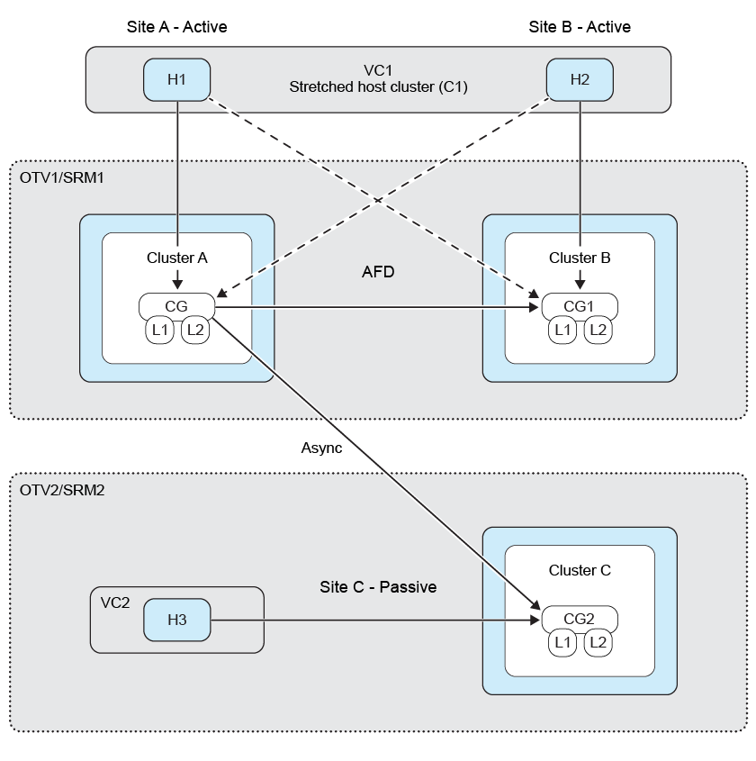

= Protection de sortie de ventilateur
:allow-uri-read: 
:icons: font
:imagesdir: ../media/

[role="lead"]
Dans le cas d'une protection « Fan-Out », le groupe de cohérence est double-protégé avec une relation synchrone sur le premier cluster ONTAP de destination et avec une relation asynchrone sur le second cluster ONTAP de destination. Les workflows de protection active de la synchronisation SnapMirror permettent de créer, de modifier et de supprimer la protection synchrone. Les flux de travail de basculement et de reprotection SRM maintiennent la protection asynchrone.

Pour établir la protection « Fan Out », vous devez Peer trois clusters site et SVM.

Exemple :

|===

| Si | ensuite 

 a| 
* Le groupe de cohérence source se trouve sur le cluster c1 et le SVM svm1
* Le premier groupe de cohérence de destination se trouve sur le cluster c2 et le SVM svm2 et
* Le second groupe de cohérence de destination se trouve sur le cluster c3 et le SVM svm3

 a| 
* Le cluster peering sur le cluster ONTAP source sera (C1, C2) et (C1, C3).
* Le cluster peering sur le premier cluster ONTAP de destination sera (C2, C1) et (C2, C3) et
* Le cluster peering sur le second cluster ONTAP de destination sera (C3, C1) et (C3, C2).
* Le peering de SVM sur la SVM source sera (svm1, svm2) et (svm1, svm3).
* Le peering de SVM sur la première SVM de destination sera (svm2, svm1) et (svm2, svm3) et
* Le peering de SVM sur la deuxième svm de destination sera (svm3, svm1) et (svm3, svm2).

|===
Le schéma suivant présente la configuration de la protection en cas de sortie de ventilateur :  image:../media/fan-out-protection-relationship.png["Relation de protection « Fan Out »"]

*Étapes*

. Créez un nouveau magasin de données d'espace réservé. Référer https://techdocs.broadcom.com/us/en/vmware-cis/live-recovery/site-recovery-manager/8-8/site-recovery-manager-administration-8-8/about-placeholder-virtual-machines/configure-a-placeholder-datastore.html["Sélectionnez un datastore de placeholder"]
. Ajoutez un datastore à la protection de cluster hôte link:../manage/edit-hostcluster-protection.html["Modifier le cluster hôte protégé"]. Vous devez ajouter des types de règles asynchrones et synchrones.

